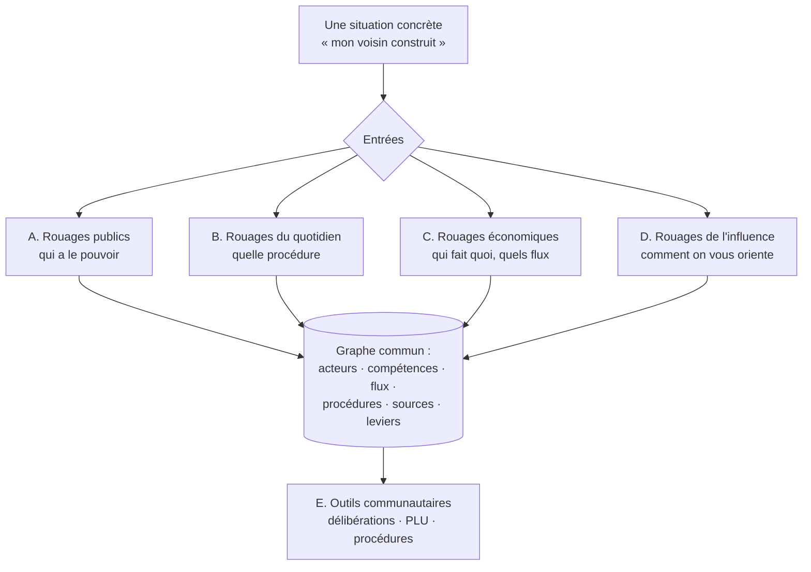

# 02 — Les grandes familles de rouages

> Statut : proposition, à valider. C'est le premier arbitrage à rendre.

Quatre familles, plus une famille d'outils. Ce ne sont pas quatre rubriques :
**ce sont quatre zones d'un même graphe**, partageant le même modèle de données
(voir `03-modele-de-donnees.md`). Rien ne les sépare techniquement ; elles disent
seulement dans quel ordre on peuple le réseau.

---

## A. Rouages publics — « qui a le pouvoir »

**Définition.** La répartition des compétences, de l'argent et des mandats entre
les échelons : commune, intercommunalité (EPCI), département, région, État
déconcentré (préfet, rectorat, ARS), État central, Union européenne. Plus les
organismes que personne ne situe : SDIS, syndicat des eaux, bailleur social,
agence de l'eau, CAF, chambres consulaires.

**Exemples de nœuds.** « Le conseil municipal », « La communauté de communes »,
« Qui gère l'eau potable ? », « Le préfet », « Le budget d'une commune : d'où
vient l'argent », « Qui décide de la carte scolaire ».

**Open data typique.** Budgets locaux (DGFiP / OFGL), Base des collectivités
(BANATIC pour les EPCI et leurs compétences), Répertoire National des Élus,
subventions, marchés publics (DECP).

**Pourquoi en premier.** Densité de contact citoyen maximale, données ouvertes
riches et stables, et c'est le socle dont dépendent les familles B et E.

---

## B. Rouages du quotidien — « quelle procédure, quel délai »

**Définition.** L'entrée par la situation vécue, pas par l'institution. Chaque
nœud de cette famille est un **processus** : un déclencheur, des étapes datées, un résultat
et des voies de recours.

**Domaines.** Urbanisme et voisinage · École · Santé et grand âge · Logement ·
Justice du quotidien · Mobilité et voirie · Déchets, eau, énergie ·
Environnement et nuisances · Aides sociales.

**Exemples de nœuds.** « Un permis de construire, du dépôt au recours »,
« Une école ferme : le calendrier réel de la décision », « Contester une
délibération municipale », « Demander un document administratif (et que faire
si on refuse) », « Un projet éolien s'installe : les 6 fenêtres où l'on peut
s'exprimer ».

**Pourquoi.** Un processus est la seule chose qu'un graphe ne sait pas montrer :
le temps. C'est pourquoi il a ses propres vues (frise, fenêtres d'action) en plus
de sa place dans le réseau.

---

## C. Rouages économiques — « qui fait quoi dans une organisation »

**Définition.** Le fonctionnement interne des entreprises et des filières :
comment les métiers s'articulent, où circulent l'argent, l'information et la
décision, où se trouvent les points de friction.

**Deux sous-angles :**
- *L'organisation* : qui fait quoi dans une PME, une collectivité, un hôpital,
  une école ; ce que fait réellement un DAF, un chef de projet, un acheteur.
- *La filière* : comment un produit arrive dans le rayon, comment un logement se
  construit, comment un train circule, comment un médicament est remboursé.

**Exemples de nœuds.** « De la commande à la facture : le circuit dans une
PME », « Qui gagne quoi sur une baguette », « Un chantier de logement : les 14
intervenants », « Comment une commune achète (marchés publics) ».

**Pourquoi.** C'est le pendant privé de la famille A, ça élargit l'audience
au-delà du civisme, et c'est de la pédagogie professionnelle réutilisable en
formation. **Mais c'est aussi la famille la moins « sourçable »** (peu d'open
data, beaucoup de variabilité). À traiter après A et B, avec une exigence
particulière sur les sources.

---

## D. Rouages de l'influence — prebunking *(phase 2)*

**Définition.** Les mécanismes par lesquels on oriente une décision ou une
opinion : lobbying, astroturfing, capture réglementaire, économie de
l'attention, conflits d'intérêts, rhétorique manipulatoire.

**Règle absolue : on décrit des mécanismes, jamais des personnes.**
« Comment fonctionne un faux mouvement citoyen » est un nœud Rouages.
« Untel a monté un faux mouvement citoyen » ne l’est pas. Cette règle est ce
qui protège juridiquement le site et préserve sa crédibilité acquise sur A/B/C.

**Exemples de nœuds.** « Le cycle de vie d'une rumeur locale », « Comment un
amendement apparaît sans auteur apparent », « Astroturfing : les signaux
observables », « À qui appartient mon journal local ».

**Pourquoi après.** Le prebunking n'a d'effet que porté par une source déjà
perçue comme neutre. Publier ça en premier ferait basculer le site dans la
catégorie « média d'opinion » et contaminerait la lecture des familles A à C.

---

## E. Outils communautaires *(phase 3, produit distinct)*

Recherche plein texte dans les délibérations de conseils municipaux et
communautaires · assistance à la lecture d'un PLU · recherche de la procédure
applicable dans les documents officiels.

Ce ne sont pas des nœuds, ce sont des **applications** adossées au graphe.
Elles ont un coût technique, juridique et d'exploitation d'un autre ordre. Voir
`05-roadmap.md` et `07-risques.md`.

---

## Critère d'admission d'un nœud

Un nœud est publiable si, et seulement si :

- [ ] il est **relié** à au moins un autre nœud — un nœud isolé n'apporte rien ;
- [ ] il porte **au moins un lien sortant** vers une page de référence ;
- [ ] il tient en **une phrase** (280 signes, contrôlés par le schéma) ;
- [ ] il porte une **date de vérification** ;
- [ ] son niveau de `confiance` est honnête, y compris
      « variable selon le territoire ».

## Les branches du pouvoir

La carte d'ensemble range par échelon territorial : qui est loin, qui est près.
La séparation des pouvoirs est orthogonale à cet axe — elle se joue entièrement
à l'intérieur d'une seule colonne, celle de l'État. Les deux ne tiennent donc
pas dans le même schéma, d'où la page dédiée.

Toute entité de l'État déclare la branche dont elle relève, dans `pouvoirs`.
Le champ est **exigé** de tout acteur national, de toute juridiction et de toute
autorité indépendante, et **refusé** partout ailleurs — `scripts/valider.ts`
applique la règle. Sans elle, `pouvoirs` serait un champ facultatif que
personne ne remplirait, et une vue « par branche » à moitié remplie est pire
que pas de vue du tout.

Trois écarts au schéma appris à l'école sont assumés plutôt que masqués.

**`independant` n'est pas une quatrième branche inventée pour l'occasion.**
C'est une catégorie juridique existante : la loi n° 2017-55 place les autorités
administratives et publiques indépendantes hors de la hiérarchie des trois
pouvoirs. Les ranger sous « exécutif » parce qu'elles sont administratives
dirait exactement le contraire de ce qui les définit.

**Le champ est une liste, parce qu'une institution peut en exercer deux.** Le
Conseil d'État est à la fois le conseil juridique obligatoire du Gouvernement
et le juge suprême de l'ordre administratif. Choisir l'une des deux fonctions
serait plus simple, et faux : il apparaît donc dans les deux bandes, tracé en
pointillé.

**Le critère n'est pas seulement l'échelon.** Une chambre régionale des comptes
siège en région tout en étant une juridiction de l'État. À l'inverse, les
personnes physiques sont exclues : un commissaire enquêteur est désigné pour
une mission, il n'incarne aucune branche. Un mandat électif, lui, en est bien
un organe — d'où la distinction entre les types `personne` et `mandat_electif`.

Cette classification a immédiatement corrigé deux erreurs de typage qui
dataient du socle : le tribunal administratif et la chambre régionale des
comptes étaient tous deux déclarés `service_deconcentre`. Un service déconcentré
est un bras de l'exécutif, ce qu'une juridiction n'est précisément pas.

## Granularité

Un nœud = **une chose qu'on peut relier**, pas un thème. « L'urbanisme » n'est
pas un nœud : ce n'est ni un acteur, ni une compétence attribuable, ni un
processus. « Écrire la règle d'urbanisme (PLU) » en est un, parce qu'on peut
nommer qui la détient et avec qui il la partage.

Test simple : si on ne peut pas tracer une arête depuis le nœud, il est mal
découpé.

## Ordre de traitement proposé

1. **A** (socle, échelon local d'abord) — indispensable au reste.
2. **B** (valeur d'usage, trafic) — en s'appuyant sur A.
3. **C** (élargissement d'audience).
4. **D** (prebunking) — une fois la crédibilité installée.
5. **E** (outils) — quand le graphe est assez dense pour en tirer parti.
