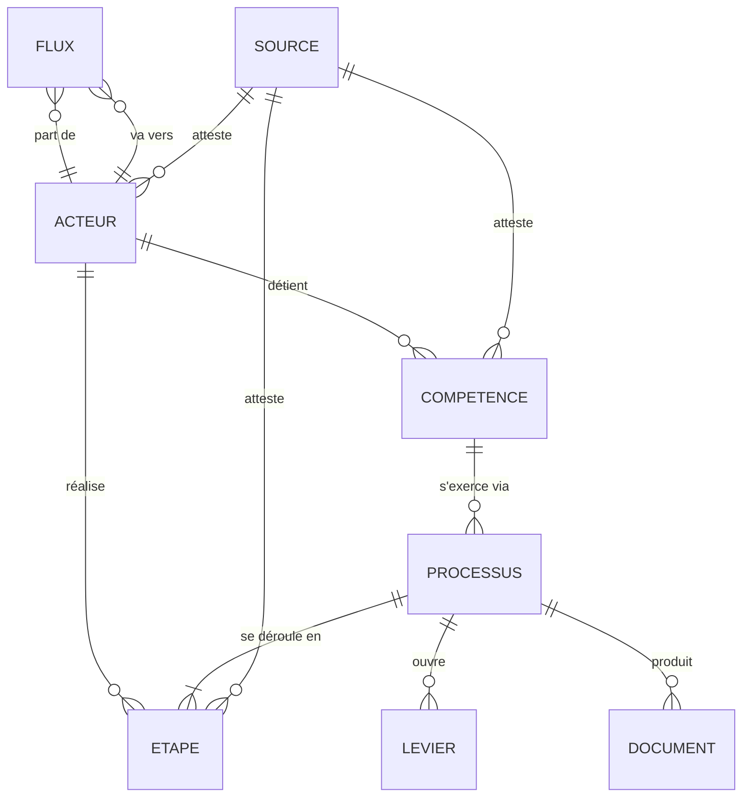

# 03 — Modèle de données

> Statut : proposition. **C'est la décision structurante du projet.**

## Le pari

Le contenu de Rouages n'est pas de la prose illustrée par des schémas.
**C'est un graphe, dont la prose et les schémas sont deux rendus.**

Conséquences directes :

- les schémas sont **générés** à partir des données, jamais dessinés à la main —
  sinon ils divergent du texte à la première mise à jour ;
- une même donnée sert plusieurs fiches (le maire apparaît dans dix processus,
  décrit une seule fois) ;
- les familles A à D partagent le même schéma : une « manipulation » est un
  processus avec des acteurs, des flux et des étapes, comme un permis de
  construire ;
- la phase 3 (outils) devient possible : chercher dans des délibérations n'a de
  sens que rattaché à des acteurs et des compétences déjà modélisés.

Si on écrit d'abord des pages HTML, on refait tout dans dix-huit mois.

## Les sept entités



| Entité | Ce qu'elle représente | Question de la vision |
|---|---|---|
| **Acteur** | Qui agit : institution, mandat électif, service, métier, entreprise, association | 1. Qui décide |
| **Compétence** | Un pouvoir de décision attribué à un acteur, avec sa base légale | 1. Qui décide |
| **Flux** | Ce qui circule : argent, information, autorisation, obligation | 2. Avec quel argent |
| **Processus** | Une suite d'étapes menant à une décision, avec ses délais | 3. Quelle procédure |
| **Document** | Ce qui est produit ou requis : délibération, arrêté, PLU, budget | 3. / 5. |
| **Source** | La preuve : article de loi, jeu de données, page officielle, Wikipédia | 4. Où est-ce écrit |
| **Levier** | Le point d'intervention citoyen : quoi, quand, auprès de qui | 5. Comment intervenir |

**« Levier » est l'entité distinctive du projet.** Aucun site existant ne la
modélise. C'est elle qui transforme une encyclopédie en outil.

## Champs communs à toute entité

| Champ | Rôle |
|---|---|
| `id` | identifiant stable, en minuscules, jamais réutilisé |
| `nom` | libellé court affichable |
| `resume` | une phrase, lisible seule |
| `sources` | liste d'`id` de sources — **obligatoire, non vide** |
| `verifie_le` | date de dernière vérification humaine |
| `verifie_par` | qui |
| `perime_apres_mois` | mois avant alerte automatique (défaut : 12) |
| `confiance` | `etabli` / `variable_selon_territoire` / `a_confirmer` |
| `wikipedia` | URL de l'article correspondant, si pertinent |

Le couple `verifie_le` / `perime_apres_mois` est ce qui empêche le site de pourrir :
une fiche périmée s'affiche comme telle, automatiquement, sans intervention.

`confiance: variable_selon_territoire` est essentiel en France : la répartition
commune / EPCI dépend des statuts locaux. Prétendre à une réponse unique serait
faux ; le dire est utile.

## Exemple concret

Voir `contenu/rouages/permis-de-construire.yaml` pour un processus complet modélisé,
et `src/modele/schemas.ts` pour le modèle sous sa forme exécutable.
Extrait :

```yaml
processus:
  id: permis-de-construire
  nom: "Permis de construire en commune dotée d'un PLU"
  declencheur: "Dépôt d'une demande par le pétitionnaire"
  etapes:
    - ordre: 3
      acteur: service-instructeur-adsdu
      action: "Instruction technique et consultation des services"
      delai: { valeur: 2, unite: mois, nature: maximum_legal }
      sources: [cu-r423-23]
  leviers:
    - id: recours-tiers-pc
      quoi: "Contester le permis délivré (recours gracieux ou contentieux)"
      quand: "2 mois à compter du premier jour d'affichage sur le terrain"
      aupres_de: "Le maire (gracieux) puis le tribunal administratif"
      difficulte: moyenne
      piege: "Le délai court depuis l'affichage sur le terrain, pas depuis la
              décision. Photographier le panneau et sa date."
```

Le champ `piege` mérite d'exister : dans la quasi-totalité des procédures, le
citoyen perd sur un point de forme, pas sur le fond.

## Comment le prebunking réutilise le même schéma

| Famille A–C | Famille D (influence) |
|---|---|
| Acteur | Acteur (émetteur, relais, cible, bénéficiaire) |
| Compétence | Capacité d'influence (budget, audience, accès) |
| Flux | Flux d'argent, d'attention, de message |
| Processus | Déroulé de la manœuvre, étape par étape |
| Levier | Signal d'alerte observable + contre-mesure |
| Source | Étude, cas documenté, littérature académique |

Aucune entité nouvelle. C'est la preuve que le modèle est bon — et cela évite un
second site.

## Règles de validation (à automatiser en CI)

1. Toute entité a au moins une source ; toute source a une URL résolvable.
2. Tout `id` référencé existe.
3. Tout processus a au moins une étape **et au moins un levier**.
4. Tout délai porte une `nature` (`maximum_legal`, `indicatif`, `observe`).
5. `verifie_le` n'est pas dans le futur ; une entité dépassant `perime_apres`
   fait échouer un contrôle « fraîcheur » (avertissement, pas blocage).
6. Aucun nom de personne physique dans la famille D.

Ces règles sont la ligne éditoriale rendue exécutable. **Elles tournent en
intégration continue depuis la première fiche** : `npm run valider` les applique,
et `npm run build` refuse de produire le site si l'une d'elles échoue. Le contrôle
de fraîcheur et la vérification des liens tournent en plus une fois par semaine.
